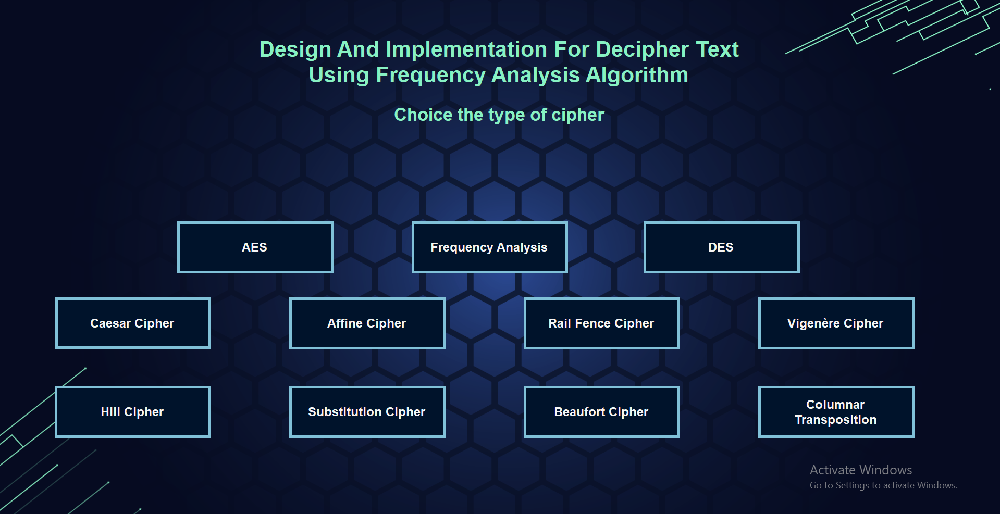
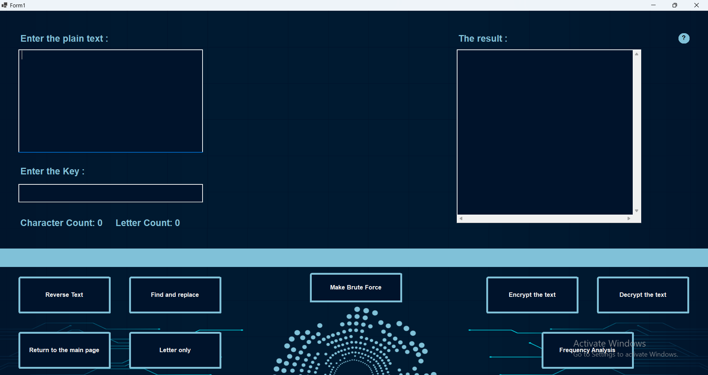
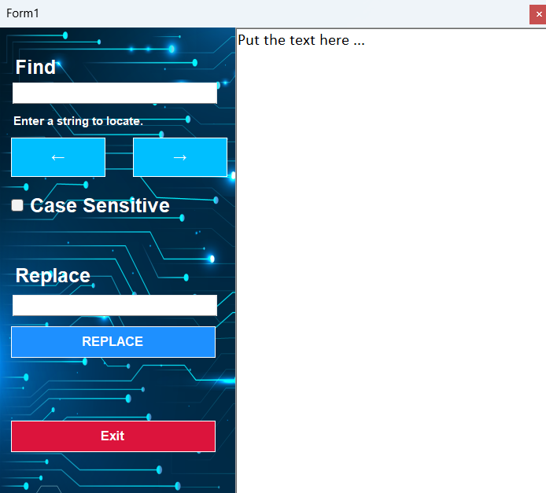
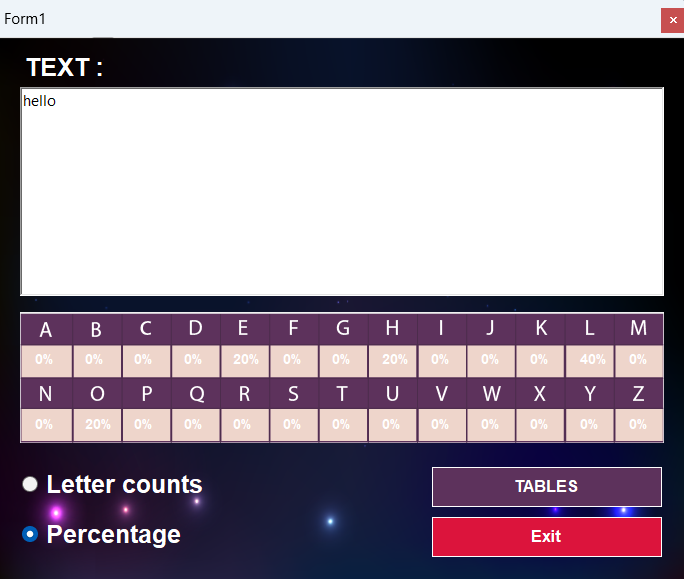

# 🕵️‍♂️ Design and Implementation for Decipher Text Using Frequency Analysis Algorithm

This project is a **C# Windows Forms Application** that provides a comprehensive platform to **encrypt, decrypt, and break classical and modern ciphers** using brute-force and frequency analysis techniques. It supports **9 major cipher algorithms** with full brute-force attack capabilities, and includes smart tools to analyze and detect the correct plaintext automatically.

> ✅ Developed by: **Sohaib Raid Rasheed**  
> 🛠️ Platform: **C# - Windows Forms Application**  
> 📅 Year: **2025** (Graduation Project)

---

## 📸 Screenshots

---

---

---

---

---

## 🔐 Supported Cipher Algorithms

This tool supports encryption, decryption, brute-force attacks, and frequency analysis for the following cipher algorithms:

| Algorithm                | Modes Supported       | Notes                                   |
|--------------------------|------------------------|------------------------------------------|
| ✅ Caesar Cipher          | Encrypt / Decrypt / Brute Force | Basic shift cipher                        |
| ✅ Vigenère Cipher        | Encrypt / Decrypt / Brute Force | Uses keyword-based shifting               |
| ✅ Rail Fence Cipher      | Encrypt / Decrypt / Brute Force | Zigzag transposition                      |
| ✅ Substitution Cipher    | Encrypt / Decrypt               | Monoalphabetic replacement                |
| ✅ Columnar Transposition | Encrypt / Decrypt / Brute Force | Rearranging columns using a keyword       |
| ✅ Affine Cipher          | Encrypt / Decrypt / Brute Force | Mathematical linear cipher                |
| ✅ DES                    | Encrypt / Decrypt / Brute Force | Symmetric-key block cipher                |
| ✅ AES                    | Encrypt / Decrypt               | Advanced Encryption Standard (128-bit)    |
| ✅ Beaufort Cipher        | Encrypt / Decrypt               | Variant of Vigenère using modulo inverse  |

---

## 🧠 Key Features

- 🔢 Frequency analysis tool for recognizing character distributions
- 🧠 Smart suggestion engine to detect the **optimal plaintext** from brute-force results
- 🧪 Side-by-side comparison of multiple brute-force attempts
- 💻 User-friendly Windows Forms interface
- 📋 Multiple cipher methods in one integrated environment
- 🗃️ Export decrypted results for external analysis

---

This project is my Graduation project so i wish you like it.
Don't forgit to give me a ⭐ on this project if you liked it.

